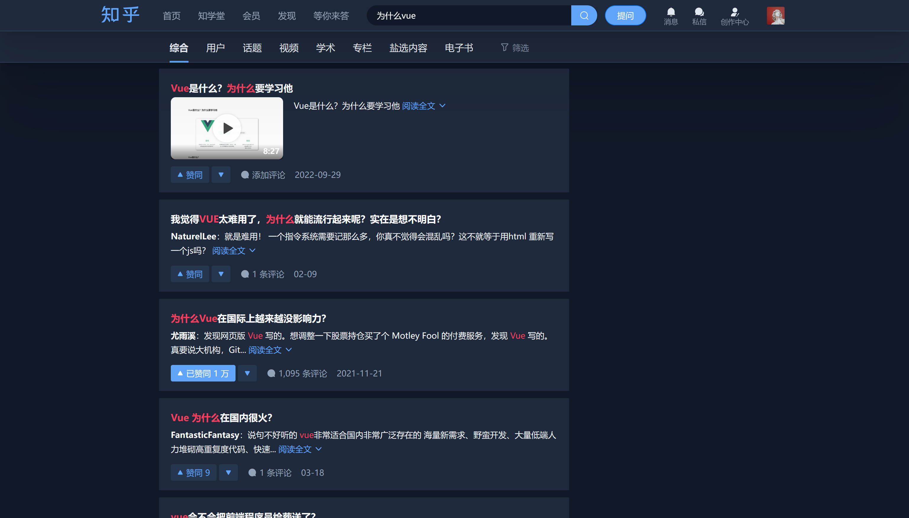
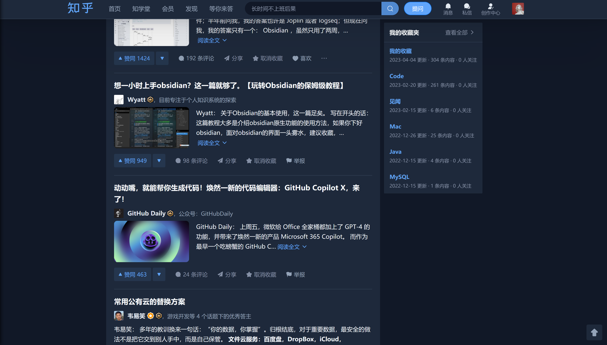

# stylus-zhihu-darkmode-tailwind

a dark mode theme based on tailwind for zhihu.com

一份基于 tailwind.css 的用于**知乎**的神色模式主题，请配合 stylus chrome 插件食用。

# 🎉 简介

- 应用于 Stylus 插件
- 样式的颜色参考 tailwind.css,主题色为 gray 系列，高亮色为 blue 系列

  - tailwind 的 gray 系列同知乎的主色调都为冷白色，所以部分来自知乎的样式在本主题下也很适合，比如某些分割线，副标题，次级按钮的颜色，这样子可以省下大量的功夫。

- 使用 sass 编译

# 🍌 食用方式

- 安装 stylus 插件:
  [https://github.com/openstyles/stylus/](https://github.com/openstyles/stylus/)

- 为 zhihu.com 添加样式文件

  - 从 release 中下载 index.css 文件
  - 克隆仓库，本地安装 node-sass 依赖

    - 运行命令

      `sass --watch src/index.scss dist/index.css`

# 😤 动力

- 网页版的知乎迟迟没有添加深色模式，所以按照 tailwind.css 的 gray 系列设计了一套深色模式的主题。
- 同时，也对网页中的元素做了一系列的调整，例如隐藏部分繁杂的内容。

# 📃 协议

MIT
